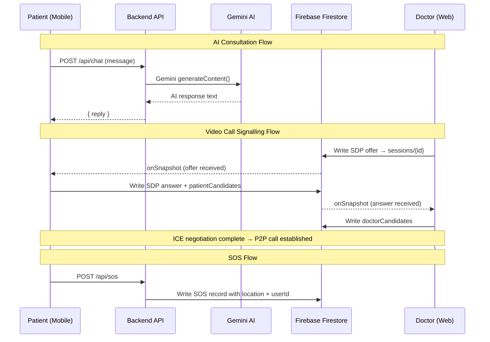

# lifeOnLine – Use Case Diagram

```mermaid
%%{init: { "theme": "base", "themeVariables": { "primaryColor": "#0D9488", "primaryTextColor": "#0F172A", "primaryBorderColor": "#0D9488", "lineColor": "#64748B", "secondaryColor": "#EFF6FF", "tertiaryColor": "#F0FDF4" } } }%%

graph TB
    %% ── Actors ─────────────────────────────────────────────────────────────
    Patient(["👤 Patient\n(Mobile App)"])
    Doctor(["🩺 Doctor\n(Web Portal)"])
    GeminiAI(["🤖 Gemini AI\n(External)"])
    Firebase(["🔥 Firebase\n(Auth + Firestore)"])
    Backend(["⚙️ Backend\n(Express API)"])

    %% ── System boundary: Mobile App ────────────────────────────────────────
    subgraph MobileApp ["📱 Mobile App (Expo / React Native)"]
        direction TB
        UC1["Register & Login"]
        UC2["View Home Dashboard"]
        UC3["Chat with AI Doctor"]
        UC4["Describe Symptoms\n& Get AI Analysis"]
        UC5["Browse Available Doctors"]
        UC6["Initiate Video Call\nwith Doctor"]
        UC7["Toggle Mic / Camera\nduring Call"]
        UC8["End Video Call"]
        UC9["Trigger SOS Alert"]
    end

    %% ── System boundary: Web Portal ────────────────────────────────────────
    subgraph WebPortal ["🌐 Doctor Web Portal (Next.js)"]
        direction TB
        UC10["Login with Google\n(OAuth via Firebase)"]
        UC11["View Doctor Dashboard"]
        UC12["See Waiting Patient Queue"]
        UC13["Accept Incoming\nVideo Call Session"]
        UC14["Toggle Mic / Camera\nduring Call"]
        UC15["End Video Call\n& Mark Session Complete"]
    end

    %% ── System boundary: Backend API ───────────────────────────────────────
    subgraph BackendAPI ["⚙️ Backend API (Node.js / Express)"]
        direction TB
        UC16["Process AI Chat\n(POST /api/chat)"]
        UC17["Analyse Symptoms\n(POST /api/analyze)"]
        UC18["Fetch Doctor List\n(GET /api/doctors)"]
        UC19["Create Session\n(POST /api/sessions)"]
        UC20["Handle SOS Alert\n(POST /api/sos)"]
        UC21["Verify Firebase\nAuth Token"]
    end

    %% ── System boundary: Real-time Signalling ──────────────────────────────
    subgraph Signalling ["🔄 WebRTC Signalling (Firebase Firestore)"]
        direction TB
        UC22["Store SDP Offer\n(doctor → Firestore)"]
        UC23["Store SDP Answer\n(patient → Firestore)"]
        UC24["Exchange ICE\nCandidates"]
        UC25["Listen for Session\nStatus Changes"]
    end

    %% ── Patient interactions ───────────────────────────────────────────────
    Patient -->|"signs up / logs in"| UC1
    Patient -->|"opens app"| UC2
    Patient -->|"types message"| UC3
    Patient -->|"enters symptoms"| UC4
    Patient -->|"taps Doctors tab"| UC5
    Patient -->|"taps Call Doctor"| UC6
    Patient -->|"during call"| UC7
    Patient -->|"hangs up"| UC8
    Patient -->|"emergency"| UC9

    %% ── Doctor interactions ────────────────────────────────────────────────
    Doctor -->|"opens portal"| UC10
    Doctor -->|"after login"| UC11
    Doctor -->|"checks queue"| UC12
    Doctor -->|"clicks Join Call"| UC13
    Doctor -->|"during call"| UC14
    Doctor -->|"ends session"| UC15

    %% ── Mobile → Backend ───────────────────────────────────────────────────
    UC3 -->|"HTTP POST"| UC16
    UC4 -->|"HTTP POST"| UC17
    UC5 -->|"HTTP GET"| UC18
    UC6 -->|"HTTP POST"| UC19
    UC9 -->|"HTTP POST"| UC20

    %% ── Web → Backend ──────────────────────────────────────────────────────
    UC10 -->|"ID token"| UC21
    UC11 -->|"fetch sessions"| UC19
    UC12 -->|"polling"| UC19

    %% ── Backend → External ─────────────────────────────────────────────────
    UC16 -->|"Gemini API call"| GeminiAI
    UC17 -->|"Gemini API call"| GeminiAI
    UC21 -->|"verify token"| Firebase

    %% ── WebRTC Signalling flow ─────────────────────────────────────────────
    UC13 -->|"writes offer"| UC22
    UC6  -->|"writes answer"| UC23
    UC22 & UC23 -->|"triggers"| UC24
    UC24 -->|"stored in"| Firebase
    UC25 -->|"onSnapshot listener"| Firebase
    UC6  -->|"subscribes"| UC25
    UC13 -->|"subscribes"| UC25

    %% ── Firebase Auth ──────────────────────────────────────────────────────
    UC1  -->|"createUser / signIn"| Firebase
    UC10 -->|"Google OAuth"| Firebase

    %% ── Backend → Firestore ────────────────────────────────────────────────
    UC19 -->|"read/write sessions"| Firebase
    UC20 -->|"write SOS record"| Firebase
    UC18 -->|"read doctors"| Firebase

    %% ── Styles ─────────────────────────────────────────────────────────────
    style Patient       fill:#EFF6FF,stroke:#1D4ED8,color:#1D4ED8
    style Doctor        fill:#F0FDF4,stroke:#16A34A,color:#16A34A
    style GeminiAI      fill:#FEF9C3,stroke:#CA8A04,color:#92400E
    style Firebase      fill:#FFF7ED,stroke:#EA580C,color:#9A3412
    style Backend       fill:#F5F3FF,stroke:#7C3AED,color:#5B21B6

    style MobileApp     fill:#EFF6FF,stroke:#1D4ED8,stroke-width:2px
    style WebPortal     fill:#F0FDF4,stroke:#16A34A,stroke-width:2px
    style BackendAPI    fill:#F5F3FF,stroke:#7C3AED,stroke-width:2px
    style Signalling    fill:#FFF7ED,stroke:#EA580C,stroke-width:2px
```

---

## Actors

| Actor | Platform | Role |
|---|---|---|
| **Patient** | Mobile App (Expo) | End user seeking medical guidance |
| **Doctor** | Web Portal (Next.js) | Licensed practitioner managing consultations |
| **Gemini AI** | External API | Powers AI chat & symptom analysis |
| **Firebase** | Cloud (Auth + Firestore) | Authentication, session signalling, data store |
| **Backend** | Express/Node.js API | Business logic, AI proxy, session management |

---

## Use Case Summary

### Patient (Mobile App)
| # | Use Case | Screen |
|---|---|---|
| UC1 | Register & Login | App launch / Auth |
| UC2 | View Home Dashboard | HomeScreen |
| UC3 | Chat with AI Doctor | ChatScreen |
| UC4 | Describe Symptoms & get AI analysis | SymptomsScreen |
| UC5 | Browse Available Doctors | DoctorScreen |
| UC6 | Initiate Video Call | VideoCallScreen |
| UC7 | Toggle Mic / Camera during call | VideoCallScreen |
| UC8 | End Video Call | VideoCallScreen |
| UC9 | Trigger SOS Alert | HomeScreen |

### Doctor (Web Portal)
| # | Use Case | Route |
|---|---|---|
| UC10 | Login with Google OAuth | `/login` |
| UC11 | View Doctor Dashboard | `/dashboard` |
| UC12 | See Waiting Patient Queue | `/dashboard` |
| UC13 | Accept Incoming Video Call | `/dashboard/call/[sessionId]` |
| UC14 | Toggle Mic / Camera during call | `/dashboard/call/[sessionId]` |
| UC15 | End Call & Mark Session Complete | `/dashboard/call/[sessionId]` |

### Backend API
| # | Use Case | Endpoint |
|---|---|---|
| UC16 | Process AI Chat | `POST /api/chat` |
| UC17 | Analyse Symptoms | `POST /api/analyze` |
| UC18 | Fetch Doctor List | `GET /api/doctors` |
| UC19 | Create / Manage Sessions | `POST/GET /api/sessions` |
| UC20 | Handle SOS Alert | `POST /api/sos` |
| UC21 | Verify Firebase Auth Token | middleware |

### WebRTC Signalling (Firebase Firestore)
| # | Use Case | Firestore Path |
|---|---|---|
| UC22 | Store SDP Offer (doctor) | `sessions/{id}.offer` |
| UC23 | Store SDP Answer (patient) | `sessions/{id}.answer` |
| UC24 | Exchange ICE Candidates | `sessions/{id}/doctorCandidates` / `patientCandidates` |
| UC25 | Listen for Session Status Changes | `onSnapshot(sessions/{id})` |

---

## Key Flows

